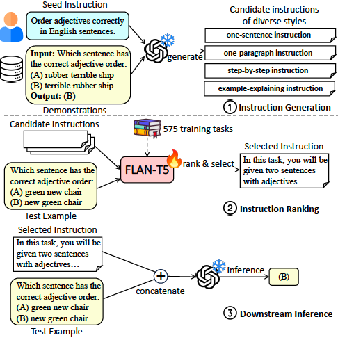

# Auto-Instruct: Automatic Instruction Generation and Ranking for Black-Box Language Models

This is the repository for Auto-Instruct, an automatic solution of generating and selecting instructions for prompting large language models (LLMs). Our method leverages the inherent generative ability of LLMs to produce diverse candidate instructions for a given task, and then ranks them using a scoring model trained on a variety of 575 existing NLP tasks. In experiments on 118 out-of-domain tasks, Auto-Instruct surpasses both human-written instructions and existing baselines of LLM-generated instructions.

The repository includes the following contents:

- `data`: the training / testing data files, meta-prompts, downstream prompts, and generated instructions.
- `GPT-3`: the source code for data, model training and model evaluation.

More details coming soon. Stay tuned!
